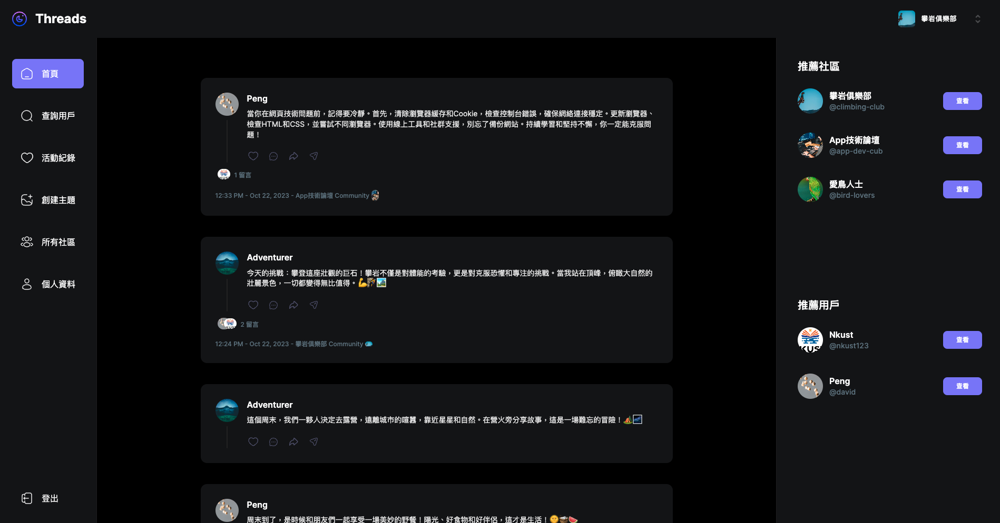
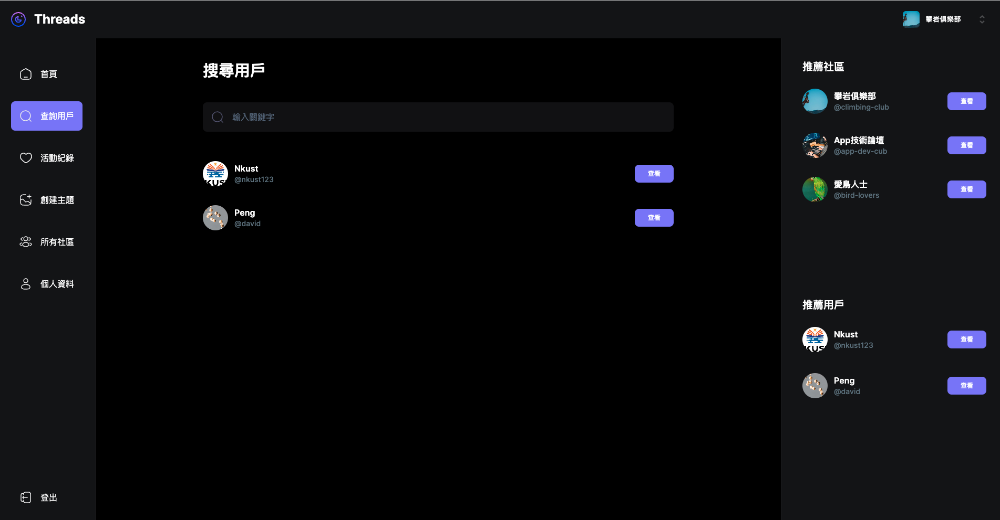
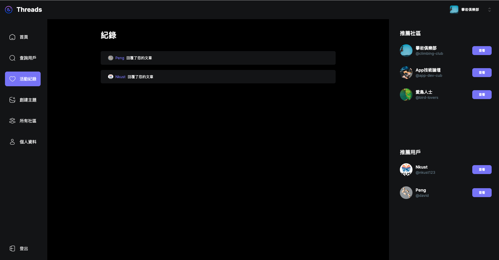
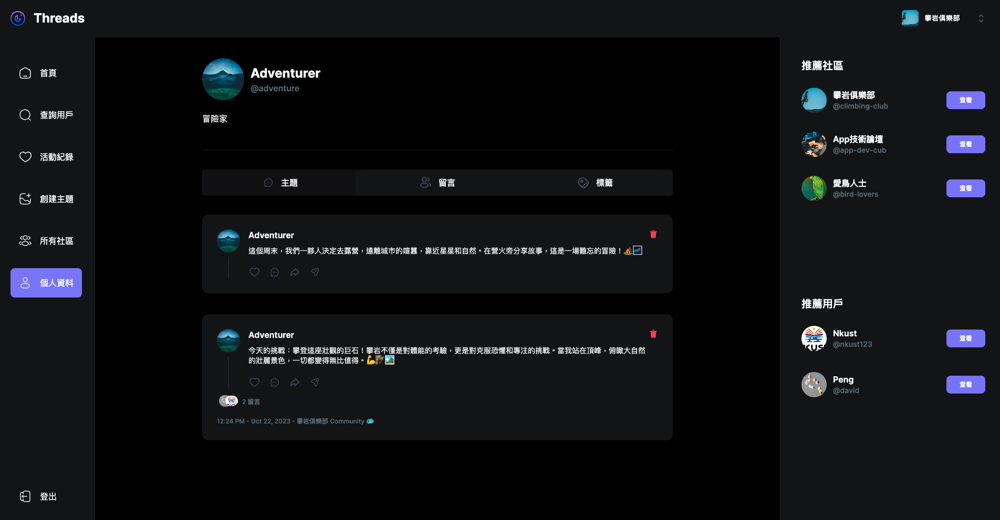

## Threads
根據Meta旗下Threads社交平台進行仿製練習

---

## 技術結構
採用了Next.js 13.4進行伺服器端渲染，MongoDB做為資料庫，TailwindCSS+Shadcn創建Ui介面，Clerk進行身份驗證、處理檔案上傳。

---

## Demo 
https://thread-clone-rosy.vercel.app/
  
---

## 網頁部分截圖：

---

---

---

